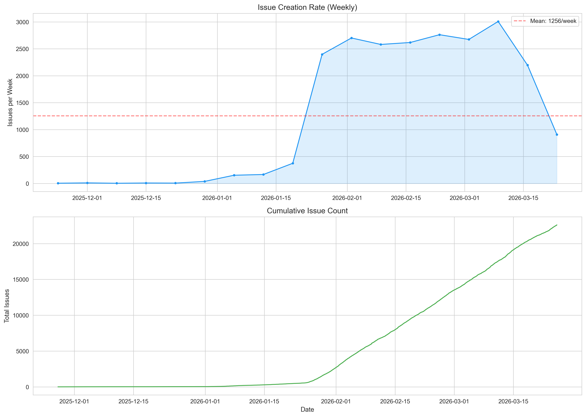
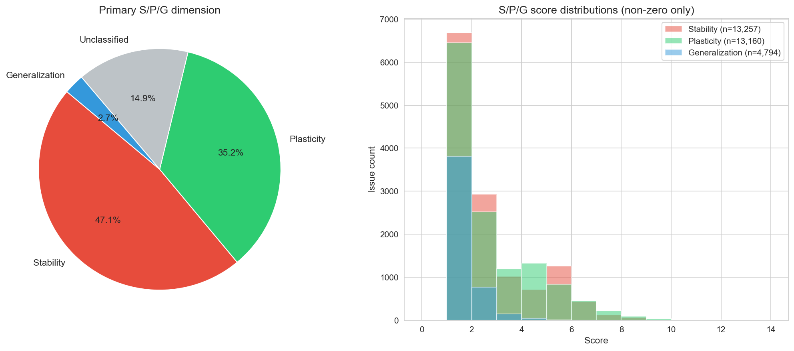
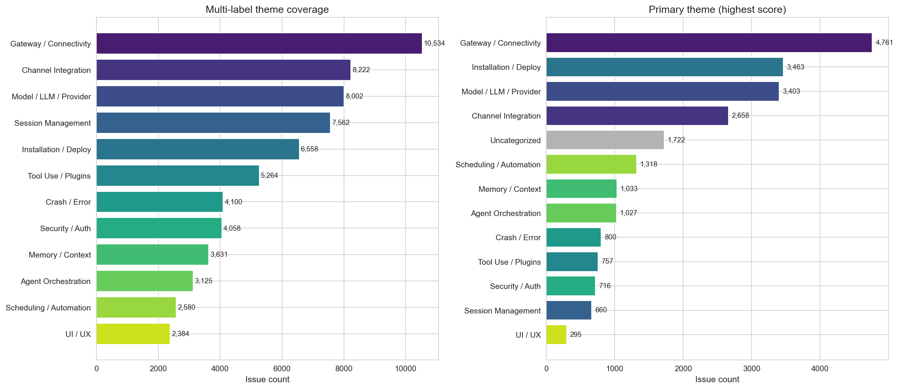

# OpenClaw Issue Corpus Analysis

对 [openclaw/openclaw](https://github.com/openclaw/openclaw) 仓库 22,613 条 GitHub Issue 的全量导出与研究性分析。

## 项目结构

```
├── fetch_issues.py          # GitHub Issue 全量导出脚本（纯 stdlib，无第三方依赖）
├── analysis.ipynb           # 研究分析 Notebook（主题分类 / S·P·G / 痛点指数…）
├── analysis_summary.md      # 分析结论报告（Markdown）
├── requirements.txt         # Python 依赖
├── .env.example             # 环境变量模板
├── figures/                 # 自动生成的可视化图表（9 张）
├── theme_table.csv          # 12 主题分布 + S/P/G 细分
├── spg_classification.csv   # 22,613 条 Issue 逐条 S/P/G 评分
├── representative_cases.csv # 每主题 Top-3 代表性 Issue
├── NOTES.md                 # 研究笔记
├── DECISIONS.md             # 分析决策日志
├── ISSUES_AND_FIXES.md      # 爬取阶段遇到的问题与解决方案
└── TODO.md                  # 任务追踪
```

## 快速开始

### 1. 导出 Issue

`fetch_issues.py` 是一个**零依赖**脚本（仅使用 Python 标准库），采用三阶段策略突破 GitHub API 的 10,000 条分页上限：

1. **Pass 1** — List API（按创建时间升序），获取前 ~5,000 条
2. **Pass 2** — List API（按创建时间降序），获取最新 ~5,000 条
3. **Pass 3** — Search API（按日期范围递归切分），填补中间缺口

```bash
# 设置 GitHub Token（推荐，可获得 5,000 req/hr 限额）
export GITHUB_TOKEN="ghp_xxxxxxxxxxxx"

# 运行导出
python3 fetch_issues.py
```

输出：
- `openclaw_issues.jsonl`（~109 MB，每行一个 JSON）
- `openclaw_issues.csv`（~103 MB）

### 2. 运行分析

```bash
# 创建虚拟环境
python3 -m venv .venv
source .venv/bin/activate

# 安装依赖
pip install -r requirements.txt

# 打开 Notebook
jupyter notebook analysis.ipynb
```

## 分析概要

### 语料库概况

| 指标 | 值 |
|---|---|
| Issue 总数 | 22,613 |
| 日期范围 | 2025-11-27 → 2026-03-25（~118 天） |
| 已关闭 | 13,362（59.1%） |
| 独立贡献者 | 14,058 |
| 中位生命周期 | 2.8 天 |

### 12 主题分类

通过关键词 + 标签的评分规则对每条 Issue 进行多标签分类（平均 2.92 主题/Issue）：

| 主题 | 多标签覆盖 | 主标签 |
|---|---|---|
| Gateway / Connectivity | 10,534 (46.6%) | 4,761 (21.1%) |
| Channel Integration | 8,222 (36.4%) | 2,658 (11.8%) |
| Model / LLM / Provider | 8,002 (35.4%) | 3,403 (15.0%) |
| Installation / Deploy | 6,558 (29.0%) | 3,463 (15.3%) |
| …及另外 8 个主题 | | |

### S/P/G（稳定性 / 可塑性 / 泛化性）分析

将持续学习理论的 S/P/G 框架映射到软件系统：

| 维度 | Primary | 发现 |
|---|---|---|
| **Stability** | 47.1% | 占比最高，且从 40% 上升至 68%——稳定性债务持续累积 |
| **Plasticity** | 35.2% | 强劲的功能需求，扩展层（Tool Use 81%、Memory 71%）主导 |
| **Generalization** | 2.7% | 占比最低——项目尚未系统性解决跨平台/边界情况 |

### 核心发现

- **Gateway/Connectivity** 是第一痛点（Pain Index 排名 #1）
- **Crash/Error** 关闭率最低（43.8%）——最难修复
- **基础设施层 vs 扩展层** 呈现经典的稳定性-可塑性张力
- Issue 量从 ~20/周 爆发至 ~3,000/周（2026年1月底）

## 可视化示例

<p align="center">
  
  <br><em>Issue 创建速率（周）与累积总量</em>
</p>

<p align="center">
  
  <br><em>S/P/G 分类分布与得分直方图</em>
</p>

<p align="center">
  
  <br><em>12 主题分布（多标签 vs 主标签）</em>
</p>

## 环境要求

- Python ≥ 3.9
- 导出脚本：无第三方依赖
- 分析 Notebook：见 [requirements.txt](requirements.txt)

## License

MIT
